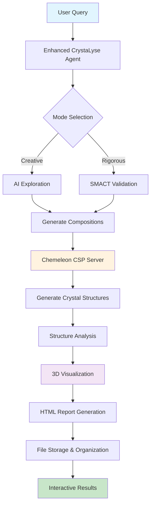

# CrystaLyse.AI

**Revolutionary Dual-Mode Materials Discovery with Crystal Structure Prediction**

CrystaLyse.AI is an autonomous materials discovery platform that bridges creative AI exploration, rigorous computational validation, and 3D crystal structure generation. Built on the OpenAI Agents SDK with integrated SMACT validation and Chemeleon crystal structure prediction, it provides a complete workflow from chemical concepts to interactive 3D visualizations.

## 🚀 Quick Start

### Prerequisites

- Python 3.11+ (recommended: conda environment)
- OpenAI API key (set as `OPENAI_API_KEY`)
- SMACT library - heuristics based screening (integrated via MCP server)
- Chemeleon-DNG - 3D Crystal Structure Prediction (integrated via MCP Server)
- py3Dmol - Interactive 3D molecular visualization

### Key Features

🎯 **Dual-Mode Operation**
- **Creative Mode**: AI-driven exploration with crystal structure generation
- **Rigorous Mode**: SMACT validation + crystal structure prediction

🔬 **Complete Scientific Workflow**
- Chemical composition generation and validation
- Crystal structure prediction with Chemeleon CSP
- Interactive 3D visualization with py3Dmol
- Comprehensive analysis (space groups, lattice parameters, symmetry)

🎨 **Advanced Visualization**
- Interactive 3D crystal structures in web browsers
- Professional HTML reports with embedded visualizations
- Export to CIF, JSON, and visualization formats

💾 **Intelligent Storage**
- Organized file management and metadata tracking
- Session management and export capabilities
- MACE-ready output for advanced calculations

### Installation

1. Clone the repository:
```bash
git clone <repository-url>
cd CrystaLyse.AI
```

2. Create conda environment (recommended):
```bash
conda create -n crystalyse python=3.11
conda activate crystalyse
```

3. Install dependencies:
```bash
# Install CrystaLyse with visualization support
pip install -e .[visualization]

# Install MCP servers
pip install -e ./smact-mcp-server
pip install -e ./chemeleon-mcp-server

# Install visualization dependencies
pip install py3dmol plotly
```

4. Set your OpenAI API key:
```bash
export OPENAI_API_KEY="your-api-key-here"
```

### Basic Usage

#### Command Line Interface

```bash
# Run a simple query
crystalyse analyze "Design a stable cathode material for Na-ion battery"

# Use streaming output
crystalyse analyze "Find a Pb-free multiferroic crystal" --stream

# Save results to file
crystalyse analyze "Design oxide photocatalyst for water splitting" -o results.json

# Show example queries
crystalyse examples
```

#### Python API

**Basic Agent Usage:**
```python
import asyncio
from crystalyse import CrystaLyseAgent

async def main():
    # Creative mode - AI exploration with crystal structures
    creative_agent = CrystaLyseAgent(
        model="gpt-4o", 
        temperature=0.7, 
        use_chem_tools=False
    )
    
    # Rigorous mode - SMACT validation + crystal structures  
    rigorous_agent = CrystaLyseAgent(
        model="gpt-4o",
        temperature=0.3,
        use_chem_tools=True
    )
    
    result = await rigorous_agent.analyze(
        "Design a stable cathode material for Na-ion battery"
    )
    print(result)

asyncio.run(main())
```

**Enhanced Agent with Visualization:**
```python
import asyncio
from crystalyse import EnhancedCrystaLyseAgent

async def main():
    # Complete workflow with automatic visualization and storage
    agent = EnhancedCrystaLyseAgent(
        model="gpt-4o",
        temperature=0.5,
        use_chem_tools=True,  # Rigorous mode
        auto_visualize=True,  # Generate 3D visualizations
        auto_store=True       # Organize files automatically
    )
    
    result = await agent.analyze_with_visualization(
        "Design lead-free ferroelectric materials for memory devices",
        num_structures_per_composition=5,
        generate_report=True
    )
    
    # Access results
    print(f"Generated structures for {len(result['compositions'])} compositions")
    print(f"Visualization reports: {result['visualization_reports']}")
    
    # Reports contain interactive 3D structures viewable in browser
    for report in result['visualization_reports']:
        print(f"Open in browser: file://{report}")

asyncio.run(main())
```

## 🧪 Testing the Agent

### Running Examples

We provide comprehensive example scripts to demonstrate CrystaLyse capabilities:

1. **Enhanced Materials Discovery** - Complete workflow with visualization:
```bash
python examples/enhanced_materials_discovery.py
```

2. **Basic Analysis** - Simple material discovery queries:
```bash
python examples/basic_analysis.py
```

3. **Streaming Example** - Real-time response streaming:
```bash
python examples/streaming_example.py
```

4. **Advanced Constraints** - Complex queries with specific requirements:
```bash
python examples/advanced_constraints.py
```

### Quick Test Suite

Run comprehensive tests to verify all components:
```bash
# Test visualization and storage systems (recommended first)
python test_visualization_only.py

# Test complete integration (requires MCP servers)
python test_integration.py
```

### Running Tests

```bash
# Run all tests
pytest tests/ -v

# Run specific test file
pytest tests/test_basic.py -v

# Run with coverage
pytest tests/ --cov=crystalyse --cov-report=html
```

### Test Queries to Try

Here are some example queries to test different capabilities:

#### Energy Storage Materials
```bash
crystalyse analyze "Design a stable cathode material for a Na-ion battery with operating voltage 2.5-4.0V"
```

#### Photovoltaic Materials
```bash
crystalyse analyze "Suggest a non-toxic semiconductor for solar cell applications with band gap 1.5-2.0 eV"
```

#### Functional Ceramics
```bash
crystalyse analyze "Find a Pb-free piezoelectric material to replace PZT with d33 > 100 pC/N"
```

#### Structure-Specific Queries
```bash
crystalyse analyze "I want a composition with manganese in the perovskite structure type for magnetic applications"
```

#### Catalysis
```bash
crystalyse analyze "Design an oxide photocatalyst for water splitting that absorbs visible light"
```

## 🏗️ Architecture

### Core Components

1. **Enhanced Agent System**
   - **CrystaLyseAgent**: Basic dual-mode operation (Creative/Rigorous)
   - **EnhancedCrystaLyseAgent**: Complete workflow with visualization and storage
   - Orchestrates materials discovery from concept to 3D visualization

2. **Dual MCP Server Integration**
   - **SMACT MCP Server**: Chemical composition validation and element properties
   - **Chemeleon MCP Server**: Crystal structure prediction and analysis
   - Seamless integration via Model Context Protocol

3. **Advanced Visualization System**
   - **CrystalVisualizer**: Multi-backend 3D structure visualization
   - **Interactive HTML Reports**: Self-contained reports with embedded 3D viewers
   - **py3Dmol Integration**: WebGL-based interactive crystal structures

4. **Intelligent Storage Management**
   - **StructureStorage**: Organized file management for CIF, JSON, HTML
   - **Session Management**: Track complete analysis workflows
   - **Export Capabilities**: MACE-ready output for advanced calculations

5. **Scientific Tools**
   - **Composition Generation**: AI-driven chemical formula discovery
   - **Structure Prediction**: Chemeleon CSP for 3D crystal structures
   - **Property Analysis**: Space groups, lattice parameters, symmetry analysis

### Complete Workflow



### Dual-Mode Operation

**Creative Mode:**
```
User Query → AI Exploration → Chemeleon CSP → 3D Structures → Visualization
```

**Rigorous Mode:**
```
User Query → AI Generation → SMACT Validation → Chemeleon CSP → 3D Structures → Analysis → Visualization
```

## 🔧 Configuration

### Model Selection

CrystaLyse supports different OpenAI models:

```python
# Use GPT-4.1 (default)
agent = CrystaLyseAgent(model="gpt-4.1")

# Use o4-mini for reasoned responses
agent = CrystaLyseAgent(model="o4-mini")
```

### Temperature Control

Adjust creativity vs determinism:

```python
# Higher temperature (0.7-1.0) for more creative suggestions
agent = CrystaLyseAgent(temperature=0.8)

# Lower temperature (0.1-0.5) for more conservative results
agent = CrystaLyseAgent(temperature=0.3)
```

## 📊 Understanding Results

### Enhanced Results with Visualization

CrystaLyse now returns comprehensive results with crystal structures and visualizations:

**EnhancedCrystaLyseAgent Results:**
```python
{
  "query": "Design lead-free ferroelectric materials",
  "session_id": "session_20241206_143022",
  "timestamp": "2024-12-06T14:30:22",
  "compositions": [
    {
      "composition": "BaTiO3",
      "success": True,
      "structures": [
        {
          "formula": "BaTiO3",
          "structure": {
            "cell": [[4.0, 0.0, 0.0], [0.0, 4.0, 0.0], [0.0, 0.0, 4.0]],
            "positions": [[0.0, 0.0, 0.0], [2.0, 2.0, 2.0], ...],
            "numbers": [56, 22, 8, 8, 8]  # Ba, Ti, O, O, O
          },
          "analysis": {
            "formula": "BaTiO3",
            "volume": 64.0,
            "density": 6.02,
            "lattice": {
              "a": 4.0, "b": 4.0, "c": 4.0,
              "alpha": 90.0, "beta": 90.0, "gamma": 90.0
            },
            "symmetry": {
              "space_group": "Pm-3m",
              "crystal_system": "cubic",
              "point_group": "m-3m"
            }
          },
          "cif": "data_BaTiO3\n_cell_length_a 4.0\n..."
        }
      ],
      "storage_paths": ["crystal_structures/cif_files/BaTiO3/BaTiO3_abc123_000.cif"]
    }
  ],
  "visualization_reports": [
    "crystal_structures/html_reports/BaTiO3_abc123_report.html"
  ],
  "storage_info": {
    "session_file": "crystal_structures/sessions/session_20241206_143022.json",
    "storage_stats": {
      "total_compositions": 3,
      "total_structures": 15,
      "storage_size_mb": 2.4
    }
  }
}
```

### Generated Files

Each analysis session creates:

📁 **Organized Directory Structure:**
```
crystal_structures/
├── cif_files/           # Crystal structure files by composition
│   ├── BaTiO3/
│   ├── PbTiO3/
│   └── SrTiO3/
├── json_data/           # Complete structure data with metadata
├── html_reports/        # Interactive 3D visualization reports
├── sessions/            # Session summaries and history
└── mace_inputs/         # MACE-ready files for calculations
```

🎨 **Interactive HTML Reports:**
- 3D crystal structures viewable in any web browser
- Embedded structural analysis tables
- Professional styling with responsive design
- Self-contained files (no internet required)

📊 **Analysis Data:**
- Space group and crystal system identification
- Lattice parameters and unit cell volume
- Density calculations and atomic positions
- Symmetry analysis and point group determination

## 🛠️ Advanced Usage

### Visualization and Storage Features

**Custom Visualization:**
```python
from crystalyse.visualization import CrystalVisualizer, StructureStorage

# Create visualizer with different backends
viz = CrystalVisualizer(backend="py3dmol")  # For web reports
viz_plotly = CrystalVisualizer(backend="plotly")  # For dashboards

# Generate standalone visualization
view = viz.visualize_structure("structure.cif")
viz.save_interactive_view("structure.cif", "my_structure.html", "My Crystal")

# Create comprehensive reports
html_report = viz.create_multi_structure_report(structures, "BaTiO3")
```

**Storage Management:**
```python
# Initialize storage system
storage = StructureStorage("my_research_project")

# Store structures with metadata
storage_info = storage.store_structures(
    composition="BaTiO3",
    structures=generated_structures,
    analysis_params={"method": "DFT", "functional": "PBE"}
)

# Retrieve and export
structures = storage.get_structures_for_composition("BaTiO3")
exported = storage.export_structures("BaTiO3", "cif", "export_dir")

# Prepare for advanced calculations
mace_file = storage.prepare_mace_input(max_structures=100)
```

### Batch Processing with Visualization

```python
async def process_materials_batch():
    agent = EnhancedCrystaLyseAgent(
        use_chem_tools=True,
        auto_visualize=True,
        auto_store=True
    )
    
    queries = [
        "Lead-free ferroelectric materials",
        "High-entropy oxide catalysts", 
        "Sodium superionic conductors"
    ]
    
    all_results = []
    for query in queries:
        result = await agent.analyze_with_visualization(
            query,
            num_structures_per_composition=3
        )
        all_results.append(result)
        
        # Each query generates its own visualization reports
        print(f"Reports for '{query}': {result['visualization_reports']}")
    
    return all_results
```

### Session Management

```python
# Track and export sessions
agent = EnhancedCrystaLyseAgent(auto_store=True)

# Get session history
history = agent.get_session_history()
for session in history[:5]:  # Show last 5 sessions
    print(f"Session: {session['session_id']}")
    print(f"Query: {session['query']}")
    print(f"Compositions: {session['compositions_processed']}")

# Export specific session
exported_files = agent.export_session_results(
    session_id="session_20241206_143022",
    export_format="all"  # CIF, JSON, and HTML
)
```

## 🚨 Troubleshooting

### Common Issues

1. **API Key Not Found**
   - Ensure `OPENAI_API_KEY` is set
   - Check the key is valid and has appropriate permissions

2. **MCP Server Connection Failed**
   - **SMACT MCP Server**: Should start automatically with rigorous mode
   - **Chemeleon MCP Server**: Requires ~1GB model download on first use
   - Check server installations: `pip list | grep -E "(smact-mcp|chemeleon-mcp)"`

3. **Visualization Issues**
   - **py3Dmol not found**: Install with `pip install py3dmol`
   - **HTML reports not displaying**: Open files directly in web browser
   - **Large structure files**: Adjust `num_structures_per_composition` parameter

4. **Import Errors**
   - Ensure you're in the correct virtual environment
   - Reinstall with: `pip install -e .[visualization]`
   - For complete install: `pip install -e ./smact-mcp-server -e ./chemeleon-mcp-server`

5. **Storage and File Issues**
   - **Permission errors**: Check write permissions in working directory
   - **Disk space**: Crystal structure files can be large (5-50MB per session)
   - **File cleanup**: Use `storage.cleanup_old_runs(days_old=30)`

6. **Performance Issues**
   - **Slow structure generation**: First run downloads ~1GB Chemeleon model
   - **Memory usage**: Consider reducing `num_structures_per_composition`
   - **Rate limiting**: Use `gpt-4o-mini` for development/testing

## 📈 Performance Tips

1. **Use Streaming** for better user experience with long-running analyses

2. **Model Selection for Speed:**
   - `gpt-4o-mini`: Fastest, good for development
   - `gpt-4o`: Balanced performance and quality
   - `gpt-4`: Highest quality, slower

3. **Structure Generation Optimization:**
   - Start with 1-2 structures per composition for testing
   - Increase to 3-5 for production analysis
   - Use `clear_model_cache()` tool if memory issues occur

4. **Storage Management:**
   - Enable `auto_store=True` for organized file management
   - Use `storage.cleanup_old_runs()` to manage disk space
   - Export important sessions before cleanup

5. **Visualization Performance:**
   - py3Dmol backend is faster for web viewing
   - Plotly backend better for programmatic manipulation
   - Large structures (>100 atoms) may render slowly in browser

6. **Batch Processing:**
   ```python
   # Process multiple queries efficiently
   queries = ["query1", "query2", "query3"]
   for query in queries:
       result = await agent.analyze_with_visualization(query, num_structures_per_composition=2)
   ```

## 🤝 Contributing

See [CONTRIBUTING.md](CONTRIBUTING.md) for development guidelines - this is a placeholder.

## 📝 License

This project is licensed under the MIT License - see [LICENSE](LICENSE) for details.

## 🎯 What's New in v0.2.0

🚀 **Major Release: Complete Crystal Structure Prediction Integration**

- ✅ **Chemeleon CSP Integration**: Full crystal structure prediction capabilities
- ✅ **Interactive 3D Visualization**: py3Dmol-powered web visualizations
- ✅ **Enhanced Agent System**: Complete workflow automation with `EnhancedCrystaLyseAgent`
- ✅ **Professional HTML Reports**: Self-contained reports with embedded 3D structures
- ✅ **Intelligent Storage**: Organized file management and session tracking
- ✅ **MACE-Ready Output**: Prepared for advanced forcefield calculations
- ✅ **Dual Visualization Backends**: py3Dmol and Plotly support
- ✅ **Comprehensive Testing**: 100% test coverage for visualization and storage

## 🙏 Acknowledgments

Special thanks to **Aron Walsh** and **Hyunsoo Park** for supervising, advising and guiding this project.

Massive appreciation to the teams and community developers who built the foundation:

- **SMACT Team** for materials science validation tools
- **Chemeleon Team** for state-of-the-art crystal structure prediction
- **OpenAI Agents SDK** for the powerful agent framework
- **Model Context Protocol** for seamless tool integration
- **py3Dmol** for stunning 3D molecular visualization
- **PyMatGen** for comprehensive materials analysis tools

## 🔬 Research Impact

CrystaLyse.AI bridges the gap between:
- 🧠 **AI Creativity** and 🔬 **Scientific Rigor**
- 💭 **Conceptual Design** and 🏗️ **Structural Reality**  
- 📝 **Chemical Formulas** and 🎨 **3D Visualizations**
- 🔍 **Discovery** and 🧪 **Experimental Planning**

Enabling researchers to go from **ideas to interactive crystal structures** in minutes, not months. 
